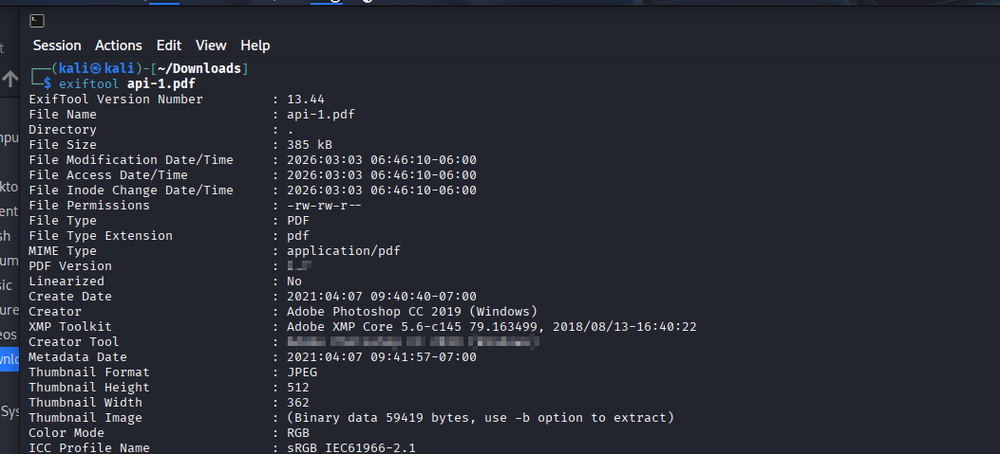

# Forensics Easy - PDF Examination

> **Category:** Forensics
> **Difficulty:** Easy
> **NCL Section:** Gymnasium

---

## 🎯 Objective

You're given a PDF file that appears to have sensitive information redacted. Your job is to extract metadata from the file and then find a way to recover the hidden content underneath the redaction boxes.

> 💡 This challenge is a perfect real-world example of why "covering" sensitive data in a PDF with a black box is NOT the same as actually removing it. The text underneath is often still there.

---

## 🛠️ Tools Needed

- `exiftool` (pre-installed on Kali) - for metadata
- An online PDF editor such as [Smallpdf](https://smallpdf.com/), [PDF24](https://tools.pdf24.org/), or [ilovepdf](https://www.ilovepdf.com/)
- The `api.pdf` file downloaded from the challenge

---

## 📋 Step-by-Step Walkthrough

### Step 1 - Q1 and Q2: Extract Metadata with ExifTool

Download `api.pdf` and run ExifTool on it:

```bash
exiftool api.pdf
```

This dumps all the metadata embedded in the file. You're looking for two specific fields.

**For Q1**, look for the `Creator Tool` field. It will tell you exactly which program was used to export this PDF. Your answer is a well-known Adobe product with a version number and OS in the name.

**For Q2**, look for the `PDF Version` field. It's a short version number. In the ExifTool output this field is partially obfuscated in the screenshot below, but when you run it on your machine the full value will be visible.



> 💡 The screenshot above shows what your ExifTool output should look like. Match the field names and read off the values. PDF Version is near the top and Creator Tool is a few lines down.

---

### Step 2 - Q3: Find the Redaction Software

Open `api.pdf` in any PDF viewer. You'll notice there are black boxes covering parts of the document, including one covering a watermark in the center of the page.

The watermark underneath the redaction box is the name of the software used to redact the file. Here's the trick to reading it without a fancy tool:

**Method 1 - Visual deduction:**

Look at what's visible around the black box covering the watermark. You can see it starts with `pd` on one side and ends with `ron` on the other. Put those together and Google the result to confirm what software it is.

**Method 2 - Online PDF editor:**

1. Go to an online PDF editor like [PDF24](https://tools.pdf24.org/en/edit-pdf) or [Smallpdf](https://smallpdf.com/edit-pdf)
2. Upload `api.pdf`
3. Click on the black redaction boxes and delete them
4. The watermark text underneath will become visible

The software name is a well known PDF toolkit used by developers. Once you see it you'll recognize it.

---

### Step 3 - Q4: Recover the Hidden Flag

The flag is hidden behind a black redaction box next to some code that reads `tlsSocket.getFlag()`.

**Method 1 - Highlight and copy (easiest):**

In your PDF viewer, click and drag to highlight the entire area around the black box covering the flag. Even though you can't see the text, it's still there underneath. When you copy and paste the selection, the hidden text behind the box will be included in what gets pasted to your clipboard.

Paste into a text editor and look for the `SKY-ABCD-1234` formatted flag in the pasted text.

**Method 2 - PDF editor:**

Same as Step 2. Open in an online PDF editor, click the black box next to `tlsSocket.getFlag()`, delete it, and read the flag that appears underneath.

---

## 💡 Hints (Without Giving It Away)

- **Q1:** The creator tool is an Adobe product. It's not Acrobat, it's their image editing software. The full answer includes the version number and the operating system it ran on.
- **Q2:** A single number, a dot, and another number. It's in the first few lines of ExifTool output. Look for the partially blurred line in the screenshot.
- **Q3:** The watermark is split by the redaction box. You can see the beginning and the end peeking out. It's a PDF SDK used by developers, not an end-user application. A quick Google of what you see will confirm it.
- **Q4:** The flag is hiding in plain sight behind a black box. You don't need to "crack" anything, just reveal what's already there. Highlight, copy, paste.

---

## ⚠️ Accuracy Tips

- ❌ **Don't guess the PDF version.** Run ExifTool and read it directly. Off-by-one version numbers are a common wrong answer.
- ❌ **Don't include extra words in Q1.** The answer is just the program name, version, and OS, exactly as ExifTool reports it in the Creator Tool field.
- ✅ **For Q3**, if you can see `pd` before the box and `ron` after it, you have enough to Google and confirm.
- ✅ **For Q4**, the highlight-and-copy method works in most PDF viewers without needing any extra tools.

---

## 🧠 Why This Works

This challenge exposes one of the most dangerous misconceptions in document security: that covering text with a black box in a PDF actually removes or hides it. In most cases it doesn't. The original text layer is still embedded in the file, the black box is just drawn on top of it visually. Proper redaction requires using a tool that physically removes the underlying text data before adding the visual overlay. Several high-profile government document leaks have happened because of exactly this mistake.

---

## 🔗 Resources

- [ExifTool Documentation](https://exiftool.org/)
- [PDF24 Online Editor](https://tools.pdf24.org/en/edit-pdf)
- [Smallpdf Editor](https://smallpdf.com/edit-pdf)

---

*Written by: Mo | Last updated: February 2026*
