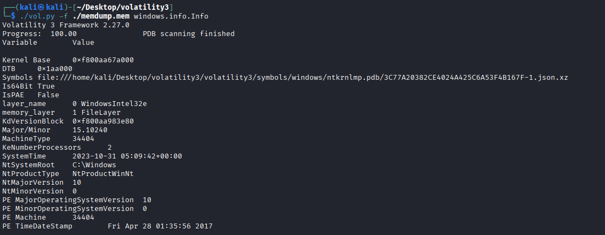
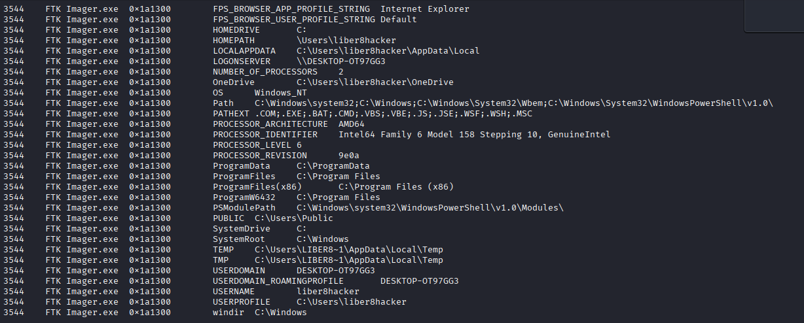
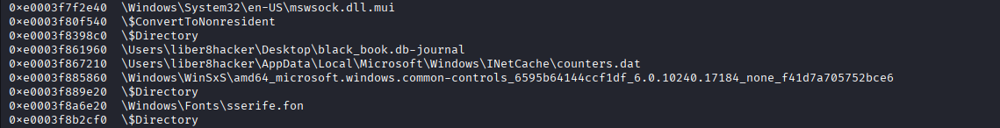
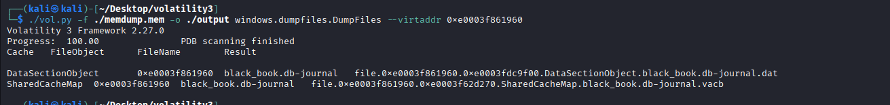
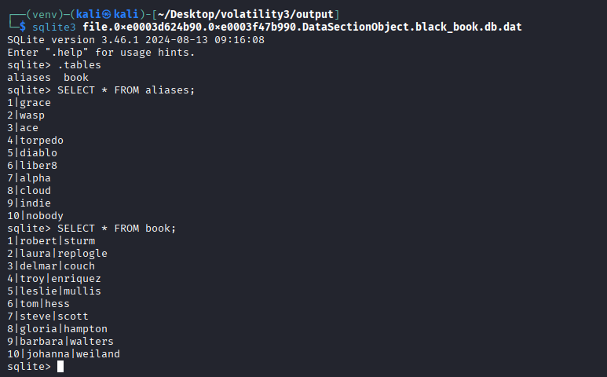
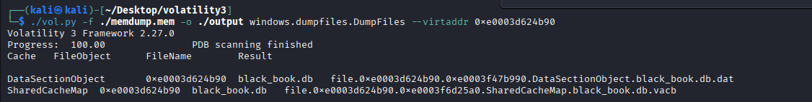
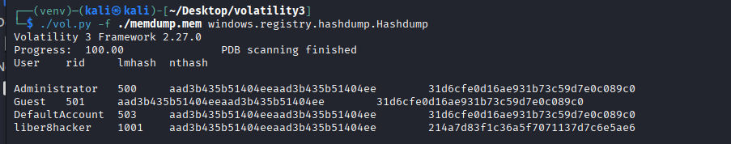
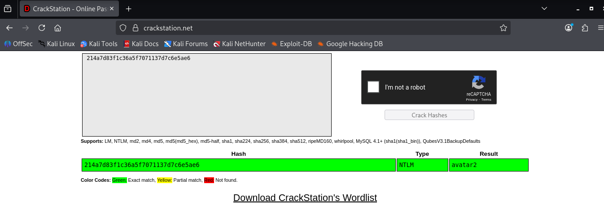

# Forensics Hard - The Book

> **Category:** Forensics
> **Difficulty:** Hard
> **NCL Section:** Gymnasium

---

## 🎯 Objective

You're given a compressed memory dump from a hacker's computer. Using Volatility3, you'll analyze what was running on the machine, extract a hidden SQLite database, find a real identity behind an alias, and crack the user's password hash.

> 😤 Real talk: this challenge has a reputation. Ask anyone in the NCL Discord who attempted it and you'll get a range of responses from "I gave up" to "I lost 3 hours of my life." The official walkthrough uses a specific version of Volatility3 that no longer works out of the box, the hashdump plugin requires a crypto module that Kali actively fights you on installing, and the whole setup process is basically a boss fight before the actual challenge even starts.
>
> But your boy did the research so you don't have to. 🫡
>
> Consider this walkthrough the cheat code. Every error we hit, every broken command, every "why is this not working" moment has been documented and solved right here. You're welcome.
>
> The walkthrough was written using Volatility3 commit `a17281a2145f5aa353fcccc35f09cfcd40ad0aa4`, recommended by the community as the working commit for this challenge. We used a **Python virtual environment** to get the hashdump working. Follow the setup steps exactly and you'll be fine.

---

## 🛠️ Tools Needed

- Kali Linux terminal
- `git`, `python3`, `pip3` (pre-installed on Kali)
- `xz` (pre-installed on Kali)
- `sqlite3` (install with `sudo apt install sqlite3`)
- **[CrackStation](https://crackstation.net/)** - for cracking the NTLM hash
- The `memdump.mem.xz` file downloaded from the challenge

---

## ⚙️ Setting Up Volatility3 (Do This First)

This setup MUST be done before anything else. Do not skip the virtual environment step or the hashdump command will fail.

```bash
cd ~/Desktop
git clone https://github.com/volatilityfoundation/volatility3.git volatility3
cd volatility3
git checkout a17281a2145f5aa353fcccc35f09cfcd40ad0aa4
```

> ⚠️ **CRITICAL: Activate the virtual environment BEFORE installing anything.** If you skip this, pycryptodome will not be found by Volatility and the hashdump will fail with a `No module named 'Crypto'` error.

```bash
python3 -m venv venv
source venv/bin/activate
```

Your terminal prompt should now show `(venv)` at the start like this:
```
(venv)-(kali㉿kali)-[~/Desktop/volatility3]
```

If you don't see `(venv)`, the environment is not active. Run the `source` command again before continuing.

Now install the dependencies inside the venv:

```bash
pip install pycryptodome
pip install -e ".[dev]"
```

Verify pycryptodome installed correctly:

```bash
python3 -c "from Crypto.Cipher import AES; print('found')"
```

If it prints `found`, you're good. If it errors, stop and re-run the venv activation before continuing.

Now download the Windows symbol tables. Volatility needs these to understand Windows memory dumps:

```bash
wget https://downloads.volatilityfoundation.org/volatility3/symbols/windows.zip
unzip windows.zip -d volatility3/symbols/
```

> 💡 Symbol tables are like a translation dictionary for Volatility. They tell it what memory addresses mean in the context of a specific Windows version. Without them, Volatility can't make sense of the dump.

---

## 📋 Step-by-Step Walkthrough

### Step 1 - Decompress the Memory Dump

The challenge file is compressed with `.xz` compression. Decompress it first:

```bash
xz -d memdump.mem.xz
```

This creates `memdump.mem`. Copy it into your volatility3 folder:

```bash
cp ~/Downloads/memdump.mem ~/Desktop/volatility3/
```

---

### Step 2 - Q1: Identify the Operating System

Run the `file` command to identify the dump:

```bash
file memdump.mem
```

Then verify with Volatility:

```bash
./vol.py -f ./memdump.mem windows.info.Info
```



The output confirms this is a Windows memory dump. Your answer for Q1 is the specific Windows version shown.

---

### Step 3 - Q2 and Q3: Find the Computer Name and Username

Run the Windows environment variables plugin:

```bash
./vol.py -f ./memdump.mem windows.envars.Envars
```



This dumps all Windows environment variables. Scroll through the output and look for:
- `COMPUTERNAME` - this is your answer for Q2
- `USERNAME` or any path containing `C:\Users\` - this is your answer for Q3

Both values are clearly visible in the output. The computer name follows the typical Windows format of `DESKTOP-` followed by random characters.

---

### Step 4 - Q4: Find the File of Interest

Now scan for all file objects in the memory dump:

```bash
./vol.py -f ./memdump.mem windows.filescan.FileScan | grep "liber8hacker"
```

This filters the full file scan down to only files associated with the user we found in Step 3. You're looking for a database file on the Desktop.

To narrow it down further:

```bash
./vol.py -f ./memdump.mem windows.filescan.FileScan | grep "black_book"
```

You'll see two results:
- `black_book.db` - the main database
- `black_book.db-journal` - a SQLite journal/temp file

The full filepath for Q4 is the path shown for `black_book.db-journal`. Copy it exactly including the leading backslash.

---

### Step 5 - Extract the Database File

First create an output directory:

```bash
mkdir output
```

Now dump the `black_book.db-journal` file using its virtual address from the previous step:

> ⚠️ **The virtual addresses in this walkthrough are specific to this memory dump. Do NOT copy them blindly. Always use the address from YOUR filescan output.** The address starts with `0xe000` followed by more hex characters. Copy it exactly from your terminal.

```bash
./vol.py -f ./memdump.mem -o ./output windows.dumpfiles.DumpFiles --virtaddr 0xe0003f861960
```



Two files will be created in the output folder. However, the journal file is not a complete SQLite database and will give errors if you try to open it directly. You need the main `black_book.db` file instead.

Get the virtual address for `black_book.db`:

```bash
./vol.py -f ./memdump.mem windows.filescan.FileScan | grep "black_book.db"
```

Then dump it:

```bash
./vol.py -f ./memdump.mem -o ./output windows.dumpfiles.DumpFiles --virtaddr 0xe0003d624b90
```



---

### Step 6 - Q5: Find the Real Name of "cloud"

Navigate into the output folder:

```bash
cd output
ls
```

You'll see two files for each dumped file. You want the `.dat` file from the `black_book.db` dump. Install sqlite3 if you don't have it:

```bash
sudo apt install sqlite3
```

Open the database:

```bash
sqlite3 file.0xe0003d624b90.0xe0003f47b990.DataSectionObject.black_book.db.dat
```



List the tables:

```sql
.tables
```

Query the contacts table:

```sql
SELECT * FROM contacts;
```



Look through the results for the entry with the alias `cloud`. The real name associated with that entry is your answer for Q5.

Type `.exit` to leave sqlite3.

---

### Step 7 - Q6: Crack the Password

Go back to the volatility3 directory:

```bash
cd ~/Desktop/volatility3
```

> ⚠️ **REMINDER: Make sure your virtual environment is still active.** Check that `(venv)` is showing in your prompt. If not, run:
> ```bash
> source ~/Desktop/volatility3/venv/bin/activate
> ```
> Without this, the hashdump command WILL fail with a crypto error.

Run the hashdump:

```bash
./vol.py -f ./memdump.mem windows.registry.hashdump.Hashdump
```



You'll see a table with columns: `User`, `rid`, `lmhash`, `nthash`

> 💡 **Why we use the nthash and not the lmhash:**
> The `lmhash` (LAN Manager hash) is an older, weaker hashing format from the Windows 95 era. It converts passwords to uppercase before hashing and splits them into two 7-character chunks, making it much easier to crack. Modern Windows systems disable LM hashing by default, so the lmhash column often shows a placeholder value (`aad3b435b51404eeaad3b435b51404ee`) meaning it's not actually stored.
> The `nthash` (NT hash) is the real NTLM hash of the actual password including correct casing. This is the one you want.

Copy the `nthash` value for `liber8hacker` and paste it into [CrackStation](https://crackstation.net/).



CrackStation will return the plaintext password. That's your answer for Q6.

---

## 💡 Hints (Without Giving It Away)

- **Q1:** The OS is a very common version of Windows from the 2010s. Two words and a number.
- **Q2:** The computer name follows the standard Windows format of `DESKTOP-` followed by 7 uppercase characters.
- **Q3:** The username is a mashup of a political concept and the word hacker. All lowercase, no spaces.
- **Q4:** The file is a SQLite database journal file sitting on the user's Desktop. The full path starts with a backslash.
- **Q5:** A first name and last name. Two words. The alias was `cloud` and the real identity is a completely normal human name.
- **Q6:** A simple two word compound password with a number. The kind of password someone who watches a certain famous movie franchise might use.

---

## ⚠️ Accuracy Tips

- ❌ **Do NOT skip the virtual environment.** This is the single most common failure point. If you see `No module named 'Crypto'`, your venv is not active.
- ❌ **Do not use the lmhash.** Use the nthash column for Q6. The lmhash placeholder value is the same for every user and will not crack to anything useful.
- ❌ **Do not try to open the `-journal` file in sqlite3.** It will error. Dump and open the main `black_book.db` instead.
- ✅ **Keep the venv active for the entire session.** If you close and reopen your terminal, run `source ~/Desktop/volatility3/venv/bin/activate` before running any vol.py commands.
- ✅ **The `mkdir output` step is required** before running dumpfiles. Volatility will error if the output directory doesn't exist.
- ✅ **Copy virtual addresses exactly** from the filescan output. One wrong character means the dumpfiles command extracts nothing.

---

## 🧠 Why This Works

Memory forensics is one of the most powerful techniques in digital forensics because RAM captures the live state of a system at a moment in time, including running processes, open files, network connections, and decrypted data that would never appear on disk. Volatility is the industry standard tool for analyzing memory dumps and is used by incident responders and law enforcement worldwide. The techniques in this challenge, extracting file contents from memory, reading registry hives, dumping password hashes, are the same ones used in real investigations. The fact that NTLM hashes can be extracted directly from memory and cracked offline is exactly why memory protection features like Credential Guard exist in modern Windows systems.

---

## 🔗 Resources

- [Volatility3 GitHub](https://github.com/volatilityfoundation/volatility3)
- [Volatility3 Documentation](https://volatility3.readthedocs.io/)
- [CrackStation](https://crackstation.net/)
- [SQLite Browser](https://sqlitebrowser.org/)
- [NTLM Hash - Wikipedia](https://en.wikipedia.org/wiki/NT_LAN_Manager)

---

*Written by: Mo | Last updated: February 2026*
