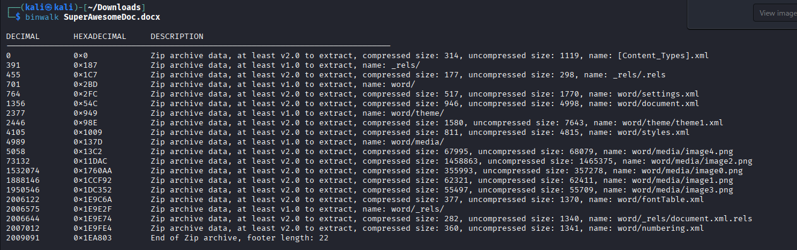
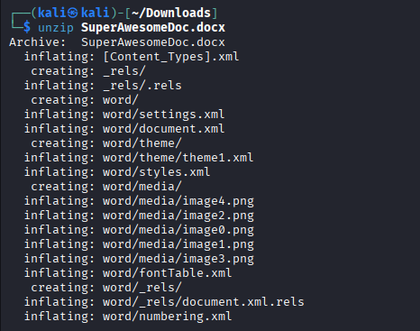

# Forensics Medium - Docter

> **Category:** Forensics
> **Difficulty:** Medium
> **NCL Section:** Gymnasium

---

## 🎯 Objective

You're given a Word document that looks completely innocent. Four boring images, two pages, nothing interesting. But there are 5 images hiding in that file, not 4. Your job is to find the extra one.

> 📄 Fun fact: a `.docx` file is literally just a ZIP archive wearing a suit and tie pretending to be a Word document. Once you know that, this whole challenge makes a lot more sense.

---

## 🛠️ Tools Needed

- Kali Linux terminal
- `binwalk` (pre-installed on Kali)
- `unzip` (pre-installed on Kali)
- Any image viewer
- The `SuperAwesomeDoc.docx` file downloaded from the challenge

---

## 📋 Step-by-Step Walkthrough

### Step 1 - Open the Document

Download `SuperAwesomeDoc.docx` and open it in any Word-compatible viewer. You'll see 4 images across 2 pages. Nothing interesting. That's intentional.

Now close it and head to the terminal because the real content isn't visible from inside Word.

---

### Step 2 - Scan with Binwalk

Run binwalk to see what's actually inside this file:

```bash
binwalk SuperAwesomeDoc.docx
```



The output will tell you this file contains ZIP archive data. That's your first clue. A `.docx` file is not what it appears to be.

> 💡 You can confirm this with a hex editor too. The first 4 bytes of the file are `50 4B 03 04`, which are the magic bytes for a ZIP archive. Every `.docx`, `.xlsx`, and `.pptx` file on the planet is secretly a ZIP file underneath. Microsoft just gave it a different extension.

---

### Step 3 - Unzip the Document

Since it's actually a ZIP archive, unzip it:

```bash
unzip SuperAwesomeDoc.docx
```



This extracts all the contents into your current directory. You'll see a `word` directory among others. That's where the document's actual contents live.

---

### Step 4 - Navigate to the Media Folder

Go into the `word` directory and look around:

```bash
cd word
ls
```

You'll see several files and a `media` directory. Navigate into it:

```bash
cd media
ls
```

Here's where it gets interesting. The Word document showed 4 images when you opened it. But this folder has **5 image files**. One of them was never shown in the document at all.

---

### Step 5 - Q1 and Q2: Find the Hidden File and the Flag

Open each image file and look at them. Four of them are the same boring images from the document. The fifth one is your hidden file and it contains the flag.

```bash
# List all files with details
ls -la

# Open images one by one to find the different one
eog image0.png
```

Or you can open the media folder in a file manager and preview them visually.

The filename of the hidden image is your answer to Q1. The flag visible inside that image is your answer to Q2 in `SKY-ABCD-1234` format.

---

## 💡 Hints (Without Giving It Away)

- **Q1:** The hidden file is a PNG. Its filename follows the pattern `imageX.png` where X is a single digit. It's the one that was never displayed inside the actual Word document.
- **Q2:** Open the file and the flag is right there on the image. No further extraction needed.

---

## ⚠️ Accuracy Tips

- ❌ **Don't just look at the document in Word and call it done.** The hidden content is never displayed by Word at all, only visible after unzipping.
- ❌ **Don't confuse the extracted `word` folder with your working directory.** Make sure you `cd word/media` to get to the images.
- ✅ **There are 5 images in the media folder but only 4 in the document.** The one that doesn't match is your target.
- ✅ **Filename matters for Q1.** Copy it exactly including the extension.

---

## 🧠 Why This Works

The `.docx` format (and `.xlsx`, `.pptx` too) is an open standard called Office Open XML, which is just a ZIP archive containing XML files and media assets. This means anyone can unzip a Word document and inspect or modify its raw contents without ever opening Microsoft Word. Attackers sometimes abuse this to hide payloads inside documents since most users and some security tools only look at what Word renders on screen. Knowing that Office files are ZIP archives is a useful trick for both offensive and defensive security work.

---

## 🔗 Resources

- [Binwalk GitHub](https://github.com/ReFirmLabs/binwalk)
- [Office Open XML - Wikipedia](https://en.wikipedia.org/wiki/Office_Open_XML)

---

*Written by: Mo | Last updated: February 2026*
