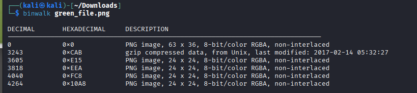
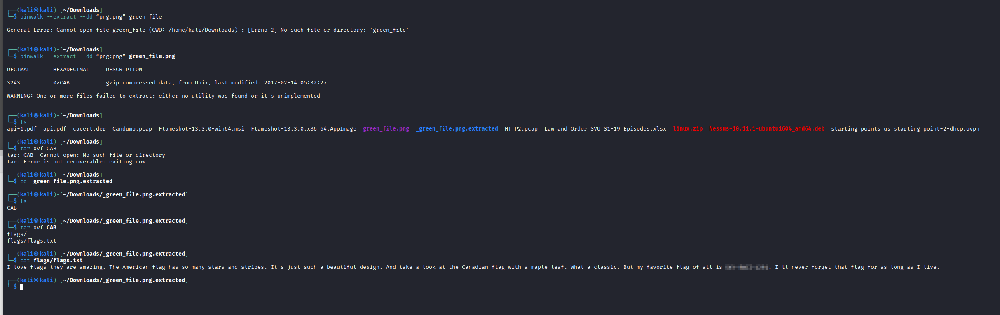

# Forensics Medium - File Carving

> **Category:** Forensics
> **Difficulty:** Medium
> **NCL Section:** Gymnasium

---

## 🎯 Objective

You're given a suspicious binary file that left the network. It looks like a green image at first glance but there's a lot more hiding inside it. Using file carving tools, you'll extract multiple embedded files and recover a hidden flag.

> 💡 If you get stuck at any point, the official NCL YouTube walkthrough covers this challenge: [File Carving Tutorial](https://www.youtube.com/watch?v=AbyeC1vSEeU)

---

## 🛠️ Tools Needed

- Kali Linux terminal
- `file` (pre-installed on Kali)
- `binwalk` (pre-installed on Kali)
- `tar` (pre-installed on Kali)
- The `green_file.bin` downloaded from the challenge

---

## 📋 Step-by-Step Walkthrough

### Step 1 - Q1: Identify the File Format

Download `green_file.bin` and run the `file` command on it:

```bash
file green_file.bin
```

The `file` command reads the **magic bytes** at the start of the file to identify its true format regardless of what the filename says. Magic bytes are unique byte sequences at the beginning of a file that identify its format. For example, every PNG file starts with the same specific bytes, every PDF starts with `%PDF`, and so on.

The output will tell you exactly what kind of file this really is. Your answer for Q1 is the file format name, all caps.

> 💡 You can rename the file to `.png` right now and use `green_file.png` for every command throughout this entire challenge, it works either way. Or keep it as `.bin` and reference it by the original name. Both approaches get you to the same result:
> ```bash
> mv green_file.bin green_file.png
> ```
> Once renamed, it opens as a plain green image with nothing obviously suspicious about it.

---

### Step 2 - Q2: Scan for Embedded Files with Binwalk

Now run `binwalk` on the file to scan for other files hidden inside it:

```bash
binwalk green_file.bin
```

Binwalk reads through the entire file looking for magic byte signatures and reports every file format it finds, along with the byte offset where each one starts. This is how you detect when multiple files have been concatenated together into one blob.

The output will show you a list of detected files. Count them up for your Q2 answer.



> 💡 The screenshot above shows what your binwalk output should look like. You should see a mix of PNG files and one compressed archive.

---

### Step 3 - Extract the Files

Now use binwalk to extract all the embedded files:

```bash
binwalk --extract --dd "png:png" green_file.bin
```

What each part does:
- `--extract`: tells binwalk to extract files it finds
- `--dd "png:png"`: extracts PNG files and gives them the `.png` extension

Binwalk will create a new directory called `_green_file.bin.extracted`. Navigate into it:

```bash
cd _green_file.bin.extracted
ls
```

You'll see several files named after their hexadecimal byte offsets in the original file.

---

### Step 4 - Identify the Non-Image File

Most of the extracted files are PNG images. But one of them is not. Run the `file` command on all of them to find the odd one out:

```bash
file *
```

One file will show up as a **tar archive**. Note its name, it will be a hex number like `CAB` or similar.

---

### Step 5 - Q3: Extract the Flag from the Archive

Unpack the tar archive:

```bash
tar xvf CAB
```

Replace `CAB` with whatever the actual filename is from your output. The `tar` command will extract the contents and you'll see a directory called `flags` containing a `flags.txt` file.

Read it:

```bash
cat flags/flags.txt
```



The flag is inside in `SKY-ABCD-1234` format.

---

## 💡 Hints (Without Giving It Away)

- **Q1:** The file looks like an image of solid green pixels. The format is one of the most common lossless image formats, four letters, all caps.
- **Q2:** Run binwalk and count every line in the output table. Include all file types, not just the images.
- **Q3:** The flag is in a text file inside a directory inside a tar archive inside the binary blob. Unpack the archive, list the contents, and read the text file.

---

## ⚠️ Accuracy Tips

- ❌ **Don't count the header line in binwalk output as a file.** Only count the actual detected file entries.
- ❌ **Don't forget to cd into the extracted directory** before running `file *`. The files won't be in your original working directory.
- ✅ **Run `file *`** inside the extracted directory to quickly spot which file is the archive vs the images.
- ✅ **The flag is inside the tar archive**, not in any of the extracted PNG images. Go for the archive first.

---

## 🧠 Why This Works

File carving is a core digital forensics technique used to recover files from disk images, memory dumps, and network captures. Because most file formats start with recognizable magic bytes, you can scan any binary blob and find embedded files even when there's no filesystem structure to guide you. This is how forensic investigators recover deleted images from hard drives, extract malware payloads from suspicious attachments, and analyze firmware dumps from embedded devices. Binwalk was originally built for analyzing embedded firmware in routers and IoT devices, which often contain entire compressed filesystems hidden inside a single binary.

---

## 🔗 Resources

- [NCL Tutorial Video - File Carving](https://www.youtube.com/watch?v=AbyeC1vSEeU)
- [Binwalk GitHub](https://github.com/ReFirmLabs/binwalk)
- [File Magic Bytes Reference](https://en.wikipedia.org/wiki/List_of_file_signatures)

---

*Written by: Mo | Last updated: February 2026*
