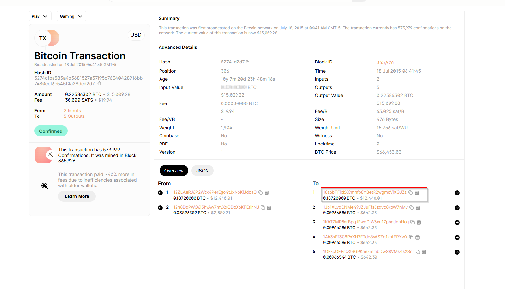

# Log Analysis Medium - History

> **Category:** Log Analysis
> **Difficulty:** Medium
> **NCL Section:** Gymnasium

---

## 🎯 Objective

You're given a Firefox SQLite browser history database. Using SQL queries, you'll dig through the user's browsing history to reconstruct what they were doing, find their Bitcoin exchange login, and trace a specific transaction on the blockchain.

> 💡 If you've never written SQL before, don't panic. The queries in this walkthrough are simple and explained line by line. You can also learn the basics here: [SQL Tutorial](https://www.tutorialrepublic.com/sql-tutorial/)

---

## 🛠️ Tools Needed

- `sqlite3` (pre-installed on Kali, install with `sudo apt install sqlite3` if missing)
- OR **[SQLite Viewer Web App](https://inloop.github.io/sqlite-viewer/)** if you prefer a GUI
- The `browser.sqlite` file downloaded from the challenge

---

## 📚 Understanding the Database Structure

Open the database:

```bash
sqlite3 browser.sqlite
```

Your prompt will change to `sqlite>`. Now list all available tables:

```sql
.tables
```

You'll see several tables. The most important one for this challenge is `moz_places`, which contains every URL the user visited along with the page title. Firefox's history database is well documented online if you want to explore further.

List the columns in `moz_places` to understand the structure:

```sql
PRAGMA table_info(moz_places);
```

The two most useful columns are `url` (the full URL visited) and `title` (the page title at the time of the visit).

---

## 📋 Step-by-Step Walkthrough

### Step 1 - Q1: What Did the User Search for on Craigslist?

Query all URLs and look for a Craigslist search:

```sql
SELECT url FROM moz_places;
```

Scroll through the output and look for a URL containing `craigslist`. The search term will be visible in the URL as a query parameter. It's in row 23.

> 💡 **What the answer looks like:** A single word. Something you might search for on Craigslist if you were interested in digital currency around 2015.

---

### Step 2 - Q2: Bitcoin Price When the User Was Browsing

The price is stored in the page title of the Bitstamp homepage the user visited. Search for entries with a dollar sign in the title:

```sql
SELECT * FROM moz_places WHERE title LIKE '%$%';
```

The `LIKE` operator with `%` wildcards searches for titles containing a `$` anywhere. Look through the results for a Bitstamp page title that shows a Bitcoin price.

> 💡 **What the answer looks like:** A price under $300. Bitcoin was cheap back then. Submit just the number, not the currency symbol.

---

### Step 3 - Q3: Which Bitcoin Exchange Did the User Log In To?

```sql
SELECT url FROM moz_places;
```

Scroll through the URLs and look for an account or dashboard page on a well known Bitcoin exchange. The login confirmation page shows up around row 253. It's one of the most recognized cryptocurrency exchanges that launched around 2012.

> 💡 **What the answer looks like:** A single lowercase word. One of the most famous early Bitcoin exchanges. Still operating today.

---

### Step 4 - Q4: Find the Gmail Address

Search for Gmail page titles:

```sql
SELECT * FROM moz_places WHERE title LIKE '%gmail%';
```

The user's Gmail inbox title will contain their email address. Look through the results for a title that includes an `@gmail.com` address.

> 💡 **What the answer looks like:** A username that sounds like a large bird, followed by `@gmail.com`.

---

### Step 5 - Q5: Find the Bitcoin Transaction ID

```sql
SELECT url FROM moz_places;
```

Scroll through and look for a `blockchain.info` URL. The transaction ID is embedded in the URL itself as a long hex string.

> ⚠️ **Important accuracy note:** There may be more than one blockchain.info transaction URL in the history. Make sure you identify the correct one. The transaction ID is a 64-character hex string. Look carefully at which URL the user actually visited and cross-reference it with the blockchain.info page to confirm it's the right one. Submitting the wrong transaction ID is a common mistake on this question.

---

### Step 6 - Q6: Total BTC Value of All Inputs

Take the transaction ID from Q5 and visit the blockchain.info page for that transaction:

```
https://www.blockchain.com/btc/tx/[TRANSACTION_ID]
```

On that page, look at the **inputs** section on the left side. Add up the BTC values of all inputs listed.



> ⚠️ **Another accuracy note:** Add carefully. The total needs to be precise to 8 decimal places. Double check your addition. The correct answer is a number just over `0.226` BTC.

---

### Step 7 - Q7: Which Address Received the Most Bitcoin?

Still on the same blockchain.info transaction page, look at the **outputs** section on the right side. Multiple Bitcoin addresses received funds from this transaction. Find the one that received the largest amount.

> 💡 **What the answer looks like:** A Bitcoin address starting with `1`, followed by a long string of alphanumeric characters. Bitcoin addresses from this era typically start with `1`.

---

## 💡 Hints (Without Giving It Away)

- **Q1:** The Craigslist search term is what you'd type if you were trying to buy or sell digital currency on Craigslist in 2015. One word.
- **Q2:** The price was under $300. Bitcoin was very affordable back then compared to today.
- **Q3:** Think of one of the earliest and most famous Bitcoin exchanges that's still running. Rhymes with a baseball position.
- **Q4:** The username part of the email describes a large bird. Not a small one.
- **Q5:** A 64-character hex string in a blockchain.info URL. Be careful to pick the right one if there are multiple.
- **Q6:** Sum up every input value on the transaction page. Be precise with decimals.
- **Q7:** The output that received the most BTC. Compare the output amounts and pick the largest.

---

## ⚠️ Accuracy Tips

- ❌ **Q5 is the most commonly wrong answer in this challenge.** If there are multiple blockchain.info URLs in the history, make sure you submit the correct transaction ID. Visit both pages if needed and verify which one the questions are asking about.
- ❌ **Don't round the BTC amounts for Q6.** Bitcoin amounts are precise to 8 decimal places. Copy the exact value.
- ❌ **Don't include the `$` symbol in Q2.** Just the number.
- ✅ **The SQLite Viewer web app** at [inloop.github.io/sqlite-viewer](https://inloop.github.io/sqlite-viewer/) lets you browse the database visually if you prefer not to use the command line.
- ✅ **`LIKE '%keyword%'`** is your best friend for searching through titles and URLs without knowing the exact value.

---

## 🧠 Why This Works

Browser history databases are one of the richest sources of information in a digital forensics investigation. Firefox, Chrome, and Edge all store history in SQLite databases with similar structures. A forensic investigator with access to someone's browser history can reconstruct their entire browsing session, find account logins, recover search terms, and even trace financial transactions as shown in this challenge. The fact that Bitcoin transactions are public on the blockchain makes this especially powerful: once you find the transaction ID in the browser history, all the financial details are publicly accessible forever. This is why privacy-conscious users often clear their browser history and use privacy-focused browsers.

---

## 🔗 Resources

- [SQLite Viewer Web App](https://inloop.github.io/sqlite-viewer/)
- [SQLite3 Documentation](https://www.sqlite.org/cli.html)
- [SQL Tutorial](https://www.tutorialrepublic.com/sql-tutorial/)
- [Firefox Places Database - MozillaZine](http://kb.mozillazine.org/Places.sqlite)
- [Blockchain.com Transaction Explorer](https://www.blockchain.com/explorer)
- [Cyber Skyline Live: Analyzing an SQL Database](https://www.youtube.com/watch?v=JCZlsuHAdEE)

---

*Written by: Mo | Last updated: February 2026*
