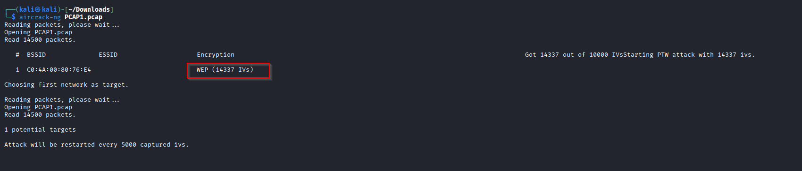
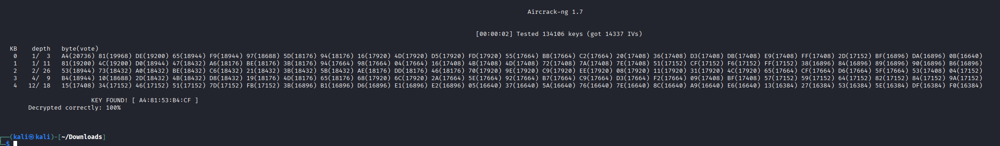
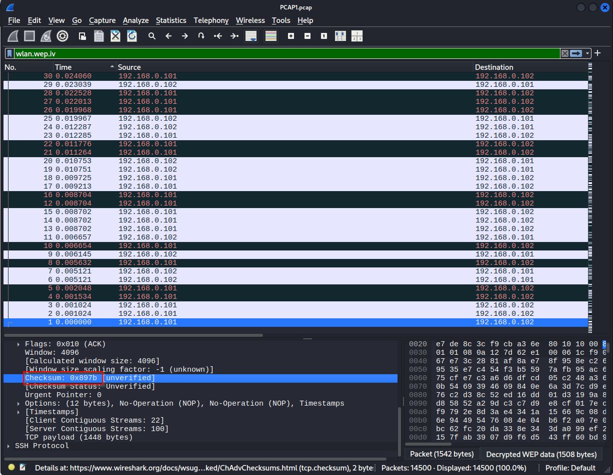

# Wireless Access Exploitation Easy - WiFi PCAP 1

> **Category:** Wireless Access Exploitation
> **Difficulty:** Easy
> **NCL Section:** Gymnasium

---

## 🎯 Objective

You're given a WiFi packet capture file from a test lab. Using aircrack-ng and Wireshark, you'll crack a WEP encrypted network, extract the encryption key, and decrypt the captured traffic to find a hidden TCP checksum.

> 💡 This challenge introduces WEP (Wired Equivalent Privacy), one of the oldest and most broken WiFi encryption standards. It was deprecated in 2004 but still shows up in CTF challenges because its weaknesses are a great introduction to wireless security concepts.

---

## 🛠️ Tools Needed

- Kali Linux terminal
- `aircrack-ng` (pre-installed on Kali)
- `Wireshark` (pre-installed on Kali)
- The `PCAP1.pcap` file downloaded from the challenge

---

## 📚 Quick Background: What is WEP?

WEP (Wired Equivalent Privacy) uses the RC4 cipher to encrypt WiFi traffic. Each packet is encrypted using a key combined with a random **Initialization Vector (IV)**. The IV is sent in plaintext alongside the encrypted packet so the receiver can decrypt it.

The problem: WEP IVs are only 24 bits long, which means they repeat frequently on busy networks. By collecting enough packets with repeated IVs, an attacker can statistically recover the WEP key. That's exactly what aircrack-ng does.

**WEP key sizes:**
- 64-bit WEP = 40-bit key + 24-bit IV
- 128-bit WEP = 104-bit key + 24-bit IV

> 💡 The key you enter as a password is shorter than the total WEP key size because the IV is added on top. This trips people up on Q1 and Q2.

---

## 📋 Step-by-Step Walkthrough

### Step 1 - Q1, Q2, Q4: Run aircrack-ng

Run aircrack-ng on the PCAP file:

```bash
aircrack-ng PCAP1.pcap
```

The output will show a summary table with:
- The number of IVs found in the capture
- The cracked WEP key

**Q1 - Number of IVs:** Read the IV count directly from the aircrack-ng output table.



> ⚠️ **Common mistake:** Pay close attention to the exact number shown. A wrong digit here costs you accuracy points.

**Q4 - The WEP Key:** The cracked key is shown at the bottom of the output in the format `XX:XX:XX:XX:XX`.



> ⚠️ **Watch out for spaces:** When submitting the WEP key, submit it exactly as aircrack-ng displays it including the colons. Do not add spaces between the hex pairs.

---

### Step 2 - Q2: Determine the Key Size in Bits

This question trips up a lot of people. Here's how to think about it:

The WEP key aircrack-ng cracked is 5 bytes long (you can count the pairs separated by colons: `XX:XX:XX:XX:XX` = 5 pairs = 5 bytes).

Now do the math:
- 5 bytes × 8 bits per byte = **40 bits** for the key itself
- But WEP adds a 24-bit IV on top of that
- 40 bits + 24 bits = **64 bits total**

> ⚠️ **The question asks for the WEP key size, not the password size.** The answer is **64** not 40. WEP key sizes are always described by their total size including the IV. This is a very common wrong answer so read carefully before submitting.

---

### Step 3 - Q3: Find the IV of the First Packet

Open `PCAP1.pcap` in Wireshark:

```bash
wireshark PCAP1.pcap
```

In the Wireshark filter bar at the top, type:

```
wlan.wep.iv
```

Press Enter to apply the filter. This shows only packets that contain a WEP IV field.

Click on the first packet in the list. In the packet details panel below, expand the **IEEE 802.11** section and look for the **WEP parameters** section. The **Initialization Vector** field value is your answer.


> 💡 **What the answer looks like:** A 6-character hexadecimal value. Submit it in uppercase without any `0x` prefix.

---

### Step 4 - Q5: Find the TCP Checksum of the First Decrypted Packet

The traffic is WEP encrypted so you can't read it yet. You need to tell Wireshark the WEP key so it can decrypt the packets for you.

**In Wireshark:**

1. Go to **Edit → Preferences**
2. In the left panel, expand **Protocols**
3. Scroll down and click **IEEE 802.11**
4. Check the box that says **Enable decryption**
5. Click **Edit** next to Decryption keys
6. Click the **+** button to add a new key
7. Set the key type to **wep**
8. Enter the WEP key from Q4 in the format `XX:XX:XX:XX:XX`
9. Click OK and close Preferences


> ⚠️ **Enter the key exactly as aircrack-ng showed it.** No spaces, colons between each byte pair, all uppercase. If the key is entered incorrectly Wireshark won't decrypt anything.

Once decryption is enabled, the packet list will update and you'll see real IP addresses instead of device names. The packets are now decrypted. Click on **packet 1** at the bottom of the list and expand the **Transmission Control Protocol** section in the packet details panel. Look for the **Checksum** field.



> 💡 **What the answer looks like:** A 4-character hexadecimal value. Submit it in uppercase without the `0x` prefix.

---

## 💡 Hints (Without Giving It Away)

- **Q1:** Read the IV count from the aircrack-ng output table. It's a 5-digit number.
- **Q2:** Count the bytes in the cracked key, multiply by 8, then add 24 for the IV. The answer is a round number that matches a standard WEP key size.
- **Q3:** Filter by `wlan.wep.iv` in Wireshark and look at the first packet. 6 hex characters.
- **Q4:** The key is shown at the bottom of aircrack-ng output. Copy it exactly with colons, no spaces.
- **Q5:** Add the WEP key to Wireshark's decryption settings first. The TCP checksum is a 4-character hex value.

---

## ⚠️ Accuracy Tips

- ❌ **Don't submit 40 for Q2.** The question asks for the total WEP key size including the IV, which is 64 bits.
- ❌ **Don't add spaces to the WEP key.** Submit it exactly as aircrack-ng displays it with colons only.
- ❌ **Don't include `0x`** when submitting hex values for Q3 and Q5.
- ✅ **Double check your IV count for Q1.** It's easy to misread a digit in the aircrack-ng output.
- ✅ **Uppercase hex only** for Q3, Q4, and Q5.

---

## 🧠 Why This Works

WEP was broken by design. The 24-bit IV space means only about 16 million unique IVs exist, and on a busy network they start repeating within hours. When two packets share the same IV, a statistical attack can recover the key. Aircrack-ng automates this attack entirely. This is why WEP was replaced by WPA and WPA2, and why any network still using WEP in the real world is completely compromised. If you ever see a WiFi network advertising WEP encryption, treat it as an open network.

---

## 🔗 Resources

- [aircrack-ng Documentation](https://www.aircrack-ng.org/documentation.html)
- [WEP - Wikipedia](https://en.wikipedia.org/wiki/Wired_Equivalent_Privacy)
- [Wireshark Documentation](https://www.wireshark.org/docs/)

---

*Written by: Mo | Last updated: February 2026*
